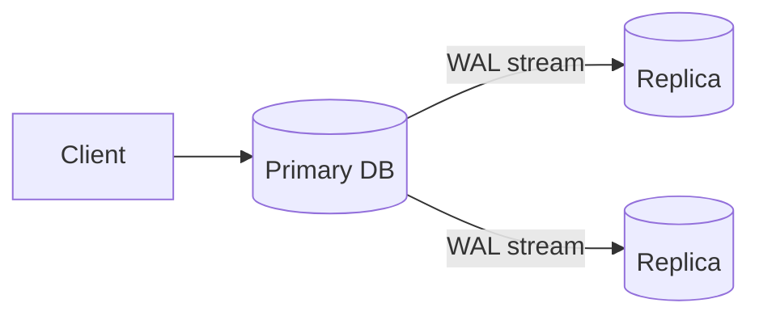

# note — capture a learning into the Obsidian second brain

You turn a messy brain-dump into a note that looks like Nitin sat down and wrote
it himself: right folder, right voice, linked up, index updated. The bar is
high. A note in the wrong folder, or one that sounds like AI, is a failure even
if the facts are correct.

## Finding the vault

**Resolve the vault root before doing anything else.** In order:

1. `$OBSIDIAN_VAULT` if it's set — this is the supported way to configure it.
2. Otherwise locate it: an Obsidian vault is any directory containing a
   `.obsidian/` folder.
   ```
   find ~ -maxdepth 6 -type d -name '.obsidian' -not -path '*/node_modules/*' 2>/dev/null
   ```
   The vault root is the **parent** of `.obsidian/`. One hit → use it. Several →
   ask which.
3. Nothing found → ask the user for the path, and suggest they
   `export OBSIDIAN_VAULT=<path>` so this step is instant next time.

**Never write to a guessed path.** If you can't resolve the vault, stop and ask —
silently creating notes at a path that doesn't exist is the worst outcome here.

Everywhere below, `$VAULT` means the resolved root.

**Before writing anything, read the voice guide:** `${CLAUDE_PLUGIN_ROOT}/VOICE.md`.
It is not optional. It is the difference between this skill working and not.

---

## Step 1 — Take the dump as-is

The user's input is whatever they said, however messy: half sentences, spoken
filler, jumped-around ordering. Don't ask them to clean it up. Your job is to
turn it into a good note, not to demand a good input.

Pull out: **the topic**, **the key points they actually made**, and **any
source** they mentioned (a video, article, book, URL).

## Step 2 — Detect the mode (auto, ask only if genuinely unclear)

- **Verbatim mode** — they clearly dumped the full content, explained the thing
  in some depth, and mostly want it cleaned up, structured, and placed. Here you
  **stay close to their words**: reorganize, tighten, format to house style, add
  wikilinks. Do not invent new sections of content.
- **Expand mode** — they gave a topic and a few sparse points ("learned about
  sharding, DBs get too big, hash vs range, hot shards") and want you to write
  the full note. Here you apply **light enrichment** per `VOICE.md`: their points
  are the backbone, you add standard connective tissue and structure, and you
  **flag anything you inferred** with a callout.
- **Topic-only expand** — the extreme of expand mode: they give just a topic
  name and nothing else (`/note logical replication in postgres`). There's no
  backbone to enrich, so you write the whole note from your own knowledge, still
  in Nitin's voice. Because none of it came from him, **accuracy discipline is
  higher**: keep it to correct, standard, well-established material, and flag
  anything genuinely uncertain with a `> [!question] Check this` callout rather
  than stating it confidently. For a large topic, confirm the depth/angle in one
  quick line before writing a wall of text (e.g. "high-level overview, or deep on
  the WAL mechanics?").

If it's ambiguous which mode they want, ask once, briefly. Otherwise just pick
and proceed.

## Step 3 — Decide placement (explore the real vault every time)

Folders change, so never work from memory. **List the current tree** under
`Learn/` (and the vault root) before deciding.

```
find $VAULT/Learn -type d -not -path '*/.*'
```

Then reason about where this topic belongs, following the vault's real shape:

- **Concept / evergreen note** (the common case: "I learned about X") goes into
  the topical hierarchy, nested as deep as the topic is specific. Examples:
  - sharding -> `Learn/System Design/Topics/Database/Sharding.md`
  - a sorting algo -> `Learn/DSA/Alogrithms/Sorting/<Name>.md`
    (note: the existing folder is literally spelled `Alogrithms` — match the real
    folder name, don't "correct" it and create a duplicate.)
  - a Rust concept -> `Learn/Languages/Rust/<Topic>.md`
- **Reading / source note** (they're capturing a specific video/article/book)
  goes into `Learn/Reading/<Domain>/<Title>.md` with the source scaffold (see
  Step 5), and its link is added to that domain's `index.md`.
- Create intermediate folders when the natural home doesn't exist yet (e.g. a
  `Database/` folder under `System Design/Topics/`). Prefer an existing folder
  over inventing a parallel one.

**When placement is unclear or two homes are equally valid, show the candidate
paths and ask** rather than dumping into a root folder or guessing. Never drop a
learning loose in the vault root or in `Inbox/` unless the user asks for Inbox.

## Step 4 — New note or merge into an existing one

Search the vault for an existing note on this topic before creating anything:

```
find $VAULT -name '*.md' -iname '*<topic>*'
grep -ril '<topic>' $VAULT/Learn
```

- **No existing note** -> create a new one (Step 5).
- **Existing note(s) found** -> do **not** silently overwrite. Read the
  existing note, then present a short plan and let the user confirm:
  - **Append a section** — the new material is a distinct subtopic; add a `##`
    section to the existing note.
  - **Merge / rewrite** — the new material overlaps or improves existing text;
    fold it in, dedupe, and keep the note coherent.
  - **New linked sub-note** — the topic is big enough to stand alone; create it
    and add a `[[wikilink]]` from the parent note.

  Show what you'll do and a diff of the change. Only write after they confirm.

## Step 5 — Write the note (in Nitin's voice)

Apply `VOICE.md` in full. The essentials:

**Evergreen concept note** — minimal frontmatter, then a bare definition body:

```markdown
---
created: <today's date, YYYY-MM-DD>
tags:
  - <domain, e.g. system-design>
  - <subtopic, e.g. databases>
---
**<Term>** is <one-sentence plain-language definition>. ...

## <first section>
...

## The key idea
<the single most important sentence, when it earns one>
```

- No H1 title (the filename is the title).
- Keep tags minimal and relevant (one to three), matching how the templates tag
  things. Don't sprinkle inline `#tags` through the body.
- Bold-on-first-mention, inline code for technical tokens, `->` not `—`,
  Obsidian `> [!info]` callouts for tradeoffs/rules, wikilinks with aliases.

**Reading / source note** — use the source scaffold Nitin already uses (see
`Learn/Reading/Databases/Why Elasticsearch Is So Fast.md`):

```markdown
# <Title>

Source: <url>
Type: <Video | Article | Book>
Date: <today's date>

---

## TL;DR
<one paragraph in Nitin's own words>

## Key points
- ...

## Why it matters / where I'd use it
- ...

## Open questions
- ...

## Links
- Related: [[<domain index>|<Domain>]]
```

## Step 5.5 — Diagrams (rarely, and only Mermaid)

A diagram is a treat, not a default. **Most notes get none.** Only add one when
the concept is genuinely visual or structural and words alone make it harder to
grasp. In practice that's roughly **one note in four (~20-30%)** — if you find
yourself adding a diagram to most notes, you're overdoing it and diluting the
ones that matter. When unsure, don't.

Good candidates (a diagram earns its place):
- a **flow or pipeline** (WAL streaming primary -> replica, request lifecycle),
- a **hierarchy or structure** (a tree, a B-tree, a partitioning layout),
- a **relationship / ER** shape, a **state machine**, a **sequence** of messages.

Bad candidates (skip the diagram): a definition, a list of tradeoffs, a cost
analysis, anything you'd only draw as a box with text in it.

Use **Mermaid** (Obsidian renders it natively, no plugin needed). Place it in the
section it illustrates, not bolted onto the end:

````markdown

````

Do **not** generate Excalidraw files — Nitin's plugin stores them as compressed
binary, which can't be hand-written reliably. Mermaid only.

## Step 6 — Wire up links both directions and update the index hub

Links are what make this a connected brain instead of a folder of orphans. Do
all three of these, not just the first.

### 6a. Forward links (new note -> existing notes)
Add `[[wikilinks]]` from the new note to clearly related existing notes, using
aliases where it reads better (`[[Partitioning|partitioning]]`).

### 6b. Backlink reconciliation (existing notes -> new note)
This is the step most setups skip. When a new note is created, go find the
existing notes that *should* now point to it, and wire them up. Two cases:

1. **Insert a contextual link.** An existing note discusses the problem this new
   note solves. Example: `Sharding.md` has a section on generating unique IDs
   across shards and lists a couple of approaches; you just created
   `Snowflake IDs.md`. Open `Sharding.md`, find that exact spot, and add the
   link there (a bullet in the list, or inline in the sentence) — not bolted at
   the bottom. The link lands where the reader is already thinking about it.

2. **Promote a plain-text mention to a link.** An existing note already says the
   word as plain prose because no note existed yet. Now one does, so convert the
   bare mention into a `[[wikilink]]`. Example: `Sharding.md` mentions
   "snowflake" in a sentence -> becomes `[[Snowflake IDs|snowflake]]`. This is
   Obsidian's "unlinked mentions" idea, done at write time.

**How to find them** — search the vault for the new note's title and its obvious
surface forms (singular/plural, with/without "IDs", common short name):

```
grep -rin 'snowflake' $VAULT/Learn
```

Be precise, not greedy: only link a mention where the note is genuinely *about*
that concept at that spot. Skip matches inside code blocks, inside existing
`[[links]]`, and incidental one-off word uses. Link the first meaningful mention
in a note, not every occurrence.

**This edits other notes, so plan-then-act:** collect the proposed edits, show
them as a short list + diff ("`Sharding.md`: add `[[Snowflake IDs]]` under the
unique-IDs section; promote the plain 'snowflake' mention in para 3"), let the
user confirm, then apply. Never silently rewrite another note.

### 6c. Update the index hub
**Update the parent `index.md`** (create one if the folder has none, following
the existing index format): add `[[<Note>]] — <date>` under the best-fitting
`##` section. Match the existing index's section style and dash convention.

## Step 7 — Show it, then save

Show the user the final note (or the diff, for a merge) and the target path
before or right as you write it, so they can catch a wrong folder or a wrong
claim. Then write the file(s), apply the confirmed backlink edits, update the
index, and confirm what landed where with the exact paths (the new note, any
notes you linked back, and the index).

Do **not** run any git commands against the vault (commit/push) unless the user
explicitly asks. Writing the files is the job; version control is theirs.

---

## Guardrails

- **Voice over everything.** If a sentence sounds like a chatbot explaining a
  concept, rewrite it as Nitin thinking. Re-read `VOICE.md` if you drift.
- **No em dashes in prose.** Ever. Use periods, colons, `->`, or parentheses.
- **Don't fabricate.** In expand mode, added claims must be standard and correct;
  flag inferences with a callout instead of stating shaky things as fact.
- **Match real folder names**, including existing typos (`Alogrithms`,
  `Aritcles`) — never create a "corrected" duplicate folder.
- **Ask before overwriting** an existing note. Merges get a plan + diff first.
- **Editing other notes needs confirmation.** Backlink reconciliation (6b) can
  touch several existing notes; always show the batch of edits + diff and get a
  yes before writing. Be precise, not greedy, about what to link.
- **Explore before placing.** List the real tree each run; folders change.
- **Diagrams are rare.** Default to none; add a Mermaid diagram only when the
  concept is truly structural (~1 note in 4). Never write Excalidraw files.
